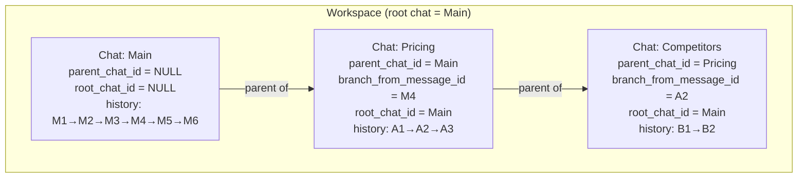
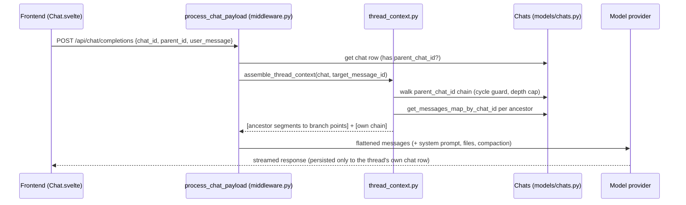
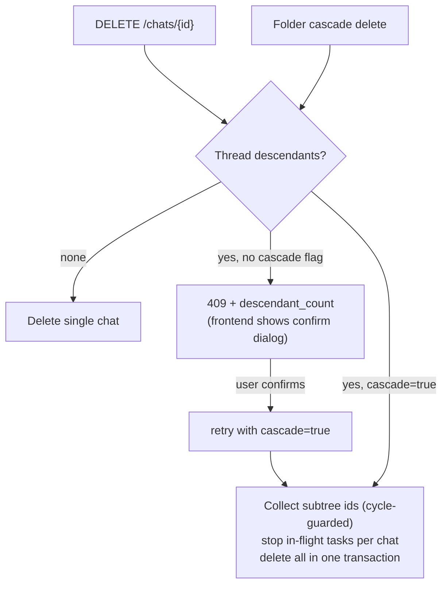

# Hierarchical Thread Branching - Plan

## Goal Capsule

- **Objective:** Add Git-like, persistent, hierarchical side-threads to this Open WebUI fork: create a thread from any message, inherit ancestor context structurally up to the branch point, isolate descendants/siblings, navigate a thread tree, rename/delete with descendant protection.
- **Authority:** `docs/specs.md` is the product authority (its section 28 invariants are non-negotiable); this plan is the implementation authority; existing repo conventions govern style and structure.
- **Execution profile:** Code. Backend: FastAPI + SQLAlchemy (async) + Alembic under `backend/open_webui/`. Frontend: SvelteKit SPA under `src/` (Svelte 5 package, Svelte-4 `export let`/`$:` idioms).
- **Stop conditions:** Stop and surface if any section 28 invariant cannot be preserved (never weaken isolation to ship), or if the completion pipeline seam (`process_chat_payload`) turns out not to control context for persisted chats.
- **Tail ownership:** The calling pipeline owns simplification, review, commit, and PR.

---

## Product Contract

### Summary

Threads become first-class `Chat` rows linked by new persistent columns (`parent_chat_id`, `branch_from_message_id`, `root_chat_id`). Context inheritance is assembled server-side at completion time by walking the ancestor chain and linearizing each ancestor up to its frozen branch point — nothing is copied into child threads. The chat view gains a recursive thread-navigator panel, a "Start side thread" message action, and thread rename/delete with descendant protection. Normal chats are unaffected; a chat with no parent is its workspace's "Main" thread.

### Problem Frame

Linear chat forces every tangent into the main conversation's future context. Open WebUI's existing answers are the wrong shape: message branching (`parentId`/`childrenIds` inside one chat) is for alternative responses, and `POST /chats/{id}/fork` deep-copies the ancestor chain into an unrelated new chat (`backend/open_webui/utils/chat_fork.py`), losing the parent-child relationship the spec requires to stay persistent and queryable. Users need durable side conversations that inherit ancestor context up to their branch point, never leak back into ancestors or siblings, and nest arbitrarily — the full motivation and target experience are specified in `docs/specs.md`.

### Requirements

Thread model and persistence:

- R1. Every non-root thread persists exactly one parent thread and exactly one branch-point message; the root thread has neither (spec invariants 1-2, sections 5, 20).
- R2. A user can create a side thread from any message (user or assistant) in any thread, to arbitrary nesting depth (sections 4, 8, 26).
- R3. Threads, branch relationships, branch points, titles, timestamps, and per-thread model selection survive refresh, logout, and server restart — persisted in the database, never only frontend state (sections 12, 24).
- R4. An ordinary existing chat acts as its workspace root ("Main"); no separate Workspace entity yet, but the schema must not preclude one later (sections 19-20).

Context construction and isolation:

- R5. A thread's model context is: each ancestor's messages from the root of that ancestor's chain up to the recorded branch point, in root-to-leaf ancestor order, followed by the thread's own active chain (section 6). Branch-point linearization walks the branch message's own recorded `parentId` chain, frozen at branch time — never the ancestor's live tip or `currentId`.
- R6. Descendant messages never enter ancestor context, and sibling threads never see each other's messages (invariants 4-5, section 7).
- R7. Ancestor messages created after the branch point never enter descendant context (section 3).
- R8. An unresolvable branch pointer (missing ancestor chat or missing branch-point message) degrades gracefully — the broken segment is skipped with a logged warning — and never fails the completion request.
- R9. The section 27 acceptance scenario (including its non-tip branch: Competitors branches from A2 while A3 exists) is covered by automated backend tests, plus isolation re-checks for the intermediate thread.

Navigation and thread management:

- R10. A hierarchical thread tree is visible from the chat view: expand/collapse, active-thread indication, click-to-switch that swaps the conversation pane without losing the tree (sections 10-11).
- R11. Every thread is URL-addressable at `/c/<chat-id>`; refresh, back/forward, bookmarks, and multiple tabs work (section 21).
- R12. Threads can be renamed manually and receive an auto-generated title after their first exchange (section 9).
- R13. Deleting a thread with descendants requires explicit confirmation naming the descendant count, then deletes the whole subtree; no delete path (chat delete, folder cascade delete) may silently orphan descendants (section 23).
- R14. Thread chats are excluded from the normal sidebar chat list, pinned/archived lists, folder chat lists, and unread counts — but their messages remain searchable via existing chat search (section 22).

Compatibility with existing capabilities:

- R15. Existing message branching (regenerated alternatives via `parentId`/`childrenIds`) is preserved unchanged and coexists with thread branching without conflation (section 5).
- R16. Existing chat capabilities keep working per thread: streaming, provider/model choice (thread-local, inherited from parent at creation), markdown, tools, attachments within a thread (sections 17, 24). Share, clone, and fork of a thread materialize its flattened inherited transcript rather than snapshotting a mid-conversation fragment.
- R17. History is never deleted because of context limits; context compaction continues to function for threads and never writes checkpoints into ancestor chats (sections 13-14, invariant 6).

### Acceptance Examples

- AE1. Section 27 tree — **Covers R5, R6, R7.**
  - **Given:** Main has M1-M4; Pricing branches from M4 with A1-A3; Competitors branches from A2 with B1-B2; Main then gains M5-M6.
  - **Then:** Main's context is M1-M6 and contains none of A1-A3, B1-B2. Pricing's context is M1-M4 + A1-A3 and contains none of B1-B2, M5-M6. Competitors' context is M1-M4 + A1-A2 + B1-B2 and contains none of A3, M5, M6.
- AE2. Non-tip branch resolution — **Covers R5.**
  - **Given:** Competitors' branch point A2 is no longer Pricing's tip (A3 exists, and Pricing's `currentId` may move further).
  - **Then:** Competitors' inherited Pricing segment still ends at A2, proving resolution walks the frozen `parentId` chain, not the live tip.
- AE3. Descendant-protected delete — **Covers R13.**
  - **Given:** Pricing has one nested thread (Competitors).
  - **When:** The user deletes Pricing.
  - **Then:** The UI warns "contains 1 nested thread" and offers delete-all or cancel; on confirm, Pricing and Competitors are both deleted and Main is untouched; without confirm nothing is deleted.
- AE4. Broken branch pointer — **Covers R8.**
  - **Given:** A thread whose branch-point message was deleted from the parent through a path that bypassed the guard.
  - **When:** The user sends a message in that thread.
  - **Then:** The completion succeeds using the thread's own messages plus whatever ancestor segments still resolve; a warning is logged.

### Scope Boundaries

Deferred to follow-up work (spec sections 11, 14, 15, 16, 22, 26 mark these later-phase):

- Merging or summarizing a thread back into its parent ("Bring to parent").
- Full Thread Context Inspector UI (the MVP ships only a branch-origin breadcrumb; the assembly function already computes the data an inspector needs).
- Drag-and-drop tree organization, re-parenting, duplicating, pinning threads, unread/new-activity indicators.
- Search results showing thread-hierarchy breadcrumbs.
- Cross-segment context compaction optimization (summarizing inherited ancestor segments); MVP compacts only the thread-local segment.
- Automatic knowledge sharing, cross-thread semantic retrieval, collaboration/thread sharing beyond existing share-link behavior.

Outside this work's identity:

- Rebuilding chat infrastructure Open WebUI already provides (providers, streaming, rendering, auth) — spec section 17 mandates reuse.
- MySQL support (this codebase's query layer supports SQLite and PostgreSQL only).

### Sources

- `docs/specs.md` — product authority; sections cited by number throughout.
- Message storage and chat model: `backend/open_webui/models/chats.py` (`Chat` table, `chat.history.messages` JSON dict, `get_messages_map_by_chat_id`, dual-write `chat_message` cache in `backend/open_webui/models/chat_messages.py`).
- Canonical single-chat linearization: `get_message_list` in `backend/open_webui/utils/misc.py`.
- Completion context seam: `process_chat_payload` / `load_messages_from_db` / `add_file_context` in `backend/open_webui/utils/middleware.py` — for persisted chats the backend rebuilds `messages` from the DB and ignores the client-sent array.
- Anti-pattern to avoid: `backend/open_webui/utils/chat_fork.py` (`build_fork_history` deep-copies); `meta.internal`/`meta.parent_chat_id` internal-chat convention with blind one-level cascade delete (`get_internal_chat_ids_by_parent_id`, `routers/chats.py` delete path) used by notes/subagents/timers.
- Tree precedents: `backend/open_webui/models/folders.py` (Python-side recursion with `seen_ids` cycle guards); `src/lib/components/layout/Sidebar/RecursiveFolder.svelte` (recursive `svelte:self`, `Collapsible`, inline rename, `FolderMenu`, `DeleteConfirmDialog`).
- Frontend chat flow: `src/lib/components/chat/Chat.svelte` (`navigateHandler`, `loadChat`, `handleForkChat`, no remount on chat-id change), `src/lib/utils/index.ts` (`createMessagesList`, `sanitizeHistory`), `src/lib/apis/chats/index.ts`.
- Migration patterns: `backend/open_webui/migrations/versions/d4e5f6a7b8c9_add_automation_tables.py`, `b2c3d4e5f6a7_add_scim_column_to_user_table.py` (hand-written, inspector-guarded, idempotent).

---

## Planning Contract

### Key Technical Decisions

- KTD1. **Threads are real `Chat` rows linked by new first-class columns** — nullable `parent_chat_id`, `branch_from_message_id`, `root_chat_id` on the `chat` table — rather than (a) subtrees inside one chat's message tree, (b) the existing `meta.internal`/`meta.parent_chat_id` convention, or (c) new `Thread`/`Message` tables. (a) would conflate thread branching with message branching in every `childrenIds` navigation surface, which spec section 5 forbids; (b) is single-level, blind-cascade-deleted, and reserved for disposable companion chats; (c) rebuilds chat infrastructure spec section 17 says to reuse. As chat rows, threads get persistence, URLs (`/c/<id>`), per-thread model selection, titles, streaming, and search for free. Governs R1, R3, R4, R11, R14, R15, R16.
- KTD2. **Context inheritance is assembled server-side in the completion pipeline, in one standalone reusable module, wired inside `load_messages_from_db` itself.** For persisted chats the backend already overwrites the client-sent messages from the DB, so the frontend cannot be the injection point — and `load_messages_from_db` has two call sites (`process_chat_payload` and the tool-approval resume path `drain_approved_tool_calls`, both in `backend/open_webui/utils/middleware.py`), so the assembly hook lives inside that function (guarded on `parent_chat_id`) rather than at one call site, or a completion resuming after a tool-approval pause would silently drop inherited context. A new `backend/open_webui/utils/thread_context.py` exposes a pure assembly function (ordered ancestor segments + own chain in, flattened message list out) plus a DB-facing resolver; share/clone/fork materialization (KTD7) reuses it. Governs R5, R6, R7.
- KTD3. **Branch-point resolution walks the branch message's own recorded `parentId` chain (frozen at branch time), never the ancestor's live tip.** Reuses `get_message_list` semantics per segment. This is what makes the section 27 non-tip case (AE2) correct, and it makes inheritance immune to the parent's later `currentId` moves. Position is frozen; content is live: inherited messages are re-read from the ancestor's stored history on every completion, so a post-branch edit of an ancestor message (or a mid-chain deletion that rewires `parentId` links) propagates into descendant context — the deliberate MVP semantic, consistent with structural (non-copying) inheritance. Governs R5, R7.
- KTD4. **The cross-chat parent walk carries a visited-set cycle guard and a hard depth cap (1000), and a broken pointer degrades to a skipped segment, not a failed request.** `branch_from_message_id` is a soft pointer into another row's JSON — no DB-enforceable FK exists for it (messages are not normalized rows with stable cross-chat PKs). Every existing cycle guard in the repo is single-chat-scoped, so the cross-chat walk needs its own. The cap is purely a corruption guard, never a product limit — spec section 4 forbids a predefined maximum nesting depth, so no creation-time depth limit exists; at the cap the resolver logs a warning and skips the root-most segments. Governs R8.
- KTD5. **Thread exclusion from listings is one shared query-scoping helper in `backend/open_webui/models/chats.py`, applied to every listing/count site.** The existing `meta['internal']` filter is copy-pasted inline across ~20 query methods and has already missed one (`count_unread_by_folder_ids`); repeating that pattern for `parent_chat_id IS NULL` would repeat the failure. Search deliberately does not apply the helper (R14 keeps threads searchable). Governs R14.
- KTD6. **Deletion protection is a 409-then-cascade contract, transactional and recursive, and every delete path routes through it.** `DELETE /chats/{id}` on a chat with thread descendants returns 409 with the descendant count unless a cascade flag is set; cascade collects the subtree (indexed `root_chat_id` query filtered to the subtree, cycle-guarded), stops in-flight tasks per chat, and deletes in one transaction. The folder cascade path (`delete_chats_by_user_id_and_folder_id`) must delete each contained chat's thread subtree through the same helper rather than orphaning it. The existing one-level internal-chat cascade is left untouched for its own use cases. Deleting a single message that is a branch point of an existing child is blocked with 409 (cheap indexed check). Governs R13.
- KTD7. **Share, clone, and fork of a non-root thread materialize the flattened inherited transcript first** (via KTD2's assembly function) so snapshots and copies are self-contained rather than starting mid-conversation. Chosen over disabling those actions for threads, which would contradict section 17's retain-existing-functionality mandate. Governs R16.
- KTD8. **This work introduces the repo's first backend pytest harness, scoped to pure functions.** No backend tests or test directory exist (a `pytest-asyncio` dev dependency is already declared in `pyproject.toml`'s `[dependency-groups].dev`, so no new dependency group is needed), but spec section 27 explicitly requires automated tests for the context invariant. The assembly function is designed pure (message maps in, list out) precisely so the invariant tests need no DB or app fixture. Frontend tree-building utilities get vitest coverage under the existing `npm run test:frontend`. Governs R9.
- KTD9. **The thread navigator is an in-chat-pane recursive panel mirroring `RecursiveFolder.svelte`, fed by one eager lightweight tree endpoint.** `GET /api/v1/chats/{id}/threads/tree` returns all nodes of the workspace (single indexed query on `root_chat_id`) as flat metadata (id, title, parent, branch point, timestamps); the frontend builds the nested structure with a pure, vitest-tested utility. Eager metadata fetch is chosen over `RecursiveFolder`'s lazy per-node content fetch because nodes are tiny. Governs R10.

### High-Level Technical Design

Data model — threads as linked chat rows above the per-chat message trees:

Completion-time context assembly for a thread (the only path that crosses chat boundaries; normal chats bypass it entirely because `parent_chat_id` is NULL):

Deletion decision flow (both entry paths converge on the same subtree-aware helper):

### Assumptions

Un-validated planning bets made in this non-interactive run; each is cheap to redirect before its owning unit lands:

- The thread view renders only the thread's own messages; inherited context is represented by a branch-origin breadcrumb ("Branched from <parent> · N inherited messages", linking to the parent), not by rendering ancestor messages inline. The full inspector stays deferred (spec section 15 marks it optional).
- Archive, pin, and move-to-folder actions are not exposed on non-root threads in the MVP; they remain single-chat operations on roots. Thread menus offer rename and delete only.
- An empty thread (created, never used) persists with a placeholder title derived from the branch-source message snippet; no auto-cleanup.
- New threads inherit the parent chat's model selection and relevant settings at creation time only; changes afterward are thread-local.
- Threads are URL-addressed by the existing `/c/<chat-id>` route; no nested `/c/<id>/thread/<tid>` route is added. This satisfies section 21's addressability goals with zero routing changes.
- Compaction is scoped to the thread-local segment in the MVP: inherited ancestor segments pass through uncompacted (with their `contextSummary` checkpoint fields stripped at assembly time, so an already-compacted ancestor cannot truncate the inherited prefix), and the compaction boundary is computed within the thread's own messages, so checkpoint writes are always thread-local and never touch an ancestor row. Context-window pressure from very long inherited chains is accepted until the deferred cross-segment compaction lands.
- Attachments referenced by inherited ancestor messages are resolved into the child's file context by extending the existing `add_file_context` walk (spec section 25's inheritance direction); child-thread attachments remain invisible to ancestors/siblings by construction.
- Access control follows chat ownership exactly as today (threads carry the same `user_id`); no new sharing/ACL surface. `AccessGrant` integration is available later if thread sharing is wanted.

### Sequencing

Backend foundation (U1-U3) → backend integration and API (U4-U6) → frontend (U7-U9). U3's pure module and tests can proceed in parallel with U2. Frontend units depend on U5's endpoints.

---

## Implementation Units

### U1. Thread columns on the chat table

- **Goal:** Persist the thread hierarchy: `parent_chat_id`, `branch_from_message_id`, `root_chat_id` as nullable columns on `chat`, exposed through the model layer.
- **Requirements:** R1, R3, R4.
- **Dependencies:** none.
- **Files:** `backend/open_webui/migrations/versions/<rev>_add_chat_thread_columns.py` (new), `backend/open_webui/models/chats.py`.
- **Approach:**
  - Hand-written Alembic migration following the repo's inspector-guarded idempotent pattern; `down_revision` set to the actual head at implementation time (verify — new migrations may have landed).
  - Indexes: `parent_chat_id`, `root_chat_id`, and composite `(parent_chat_id, branch_from_message_id)` for the branch-point-delete guard.
  - Extend the `Chat` SQLAlchemy model and `ChatModel` Pydantic model; extend `insert_new_chat` (or add a dedicated creation method) to accept the three fields. Convention: `root_chat_id` is set on descendants only; a root chat has all three NULL.
  - The three thread columns are server-controlled only: writable solely through the U5 thread-creation endpoint (which verifies parent ownership). `POST /chats/new`, `POST /chats/import`, and every chat-update path must never accept or persist client-supplied values for them — `ChatForm`/import forms do not expose them. Otherwise a verified user could mint a chat whose parent pointer targets another user's chat and pull that chat's messages into their own completions via U4.
- **Patterns to follow:** `d4e5f6a7b8c9_add_automation_tables.py` and `b2c3d4e5f6a7_add_scim_column_to_user_table.py` for migration shape; existing `ChatModel` field conventions (str ids, int epoch seconds).
- **Test scenarios:** Test expectation: none — schema and model plumbing only; behavior is exercised by U3/U5 scenarios.
- **Verification:** Migration upgrades and downgrades cleanly on SQLite; app boots; existing chats load unchanged with NULL thread columns.

### U2. Shared thread-exclusion filter for chat listings

- **Goal:** Thread chats disappear from every normal listing surface while staying searchable.
- **Requirements:** R14.
- **Dependencies:** U1 for the helper itself; U5 for the live API-smoke checks (no thread-creation endpoint exists before U5 — run those checks once U5 lands, or seed a thread row via direct DB insert). The exclusion helper is also what keeps folder-filed threads (U5 copies the parent's `folder_id`) out of folder chat lists.
- **Files:** `backend/open_webui/models/chats.py`.
- **Approach:**
  - One shared query-scoping helper (a criterion/filter function) combining the existing `meta['internal']` exclusion with `parent_chat_id IS NULL`.
  - Audit and convert every listing/count site to the helper: chat list, pinned, archived, folder chat lists, tag lists, unread counts/marks (including `count_unread_by_folder_ids`, which is missing the internal filter today), title-id lists.
  - Deliberately leave `get_chats_by_user_id_and_search_text` including threads (R14), and leave admin/all-chats paths as-is.
- **Patterns to follow:** existing inline `Chat.meta['internal']` filters show every site to convert.
- **Test scenarios:**
  - After creating a thread: sidebar chat-list API response excludes it; search API for a term in a thread message returns it.
  - Pinned/archived/folder/unread queries exclude thread chats.
  - Test expectation: DB-backed listing queries have no pytest harness — verify by API smoke against a dev instance; keep the helper trivial enough to review by inspection.
- **Execution note:** Smoke-first verification; the risk here is a missed call site, so grep-audit the full file for query methods before calling it done.
- **Verification:** Grep shows no remaining listing query composing the internal filter without the shared helper.

### U3. Context assembly module and backend test harness

- **Goal:** A pure, tested implementation of structural context inheritance — the feature's core invariant.
- **Requirements:** R5, R6, R7, R8, R9.
- **Dependencies:** U1 (for the resolver; the pure function itself has none).
- **Files:** `backend/open_webui/utils/thread_context.py` (new), `backend/open_webui/test/util/test_thread_context.py` (new), pytest configuration only if needed — `pyproject.toml` already carries `pytest-asyncio` in `[dependency-groups].dev`, so no new dependency group is required.
- **Approach:**
  - Pure function: input an ordered list of ancestor segments `(messages_map, branch_from_message_id)` plus the thread's own `(messages_map, target_message_id)`; output the flattened context list. Each segment linearizes via the frozen-`parentId` walk (reuse/mirror `get_message_list` from `backend/open_webui/utils/misc.py`), per KTD3. Each emitted message is projected to `MESSAGE_REPLAY_KEYS` exactly as `load_messages_from_db` does, so the U4 substitution is shape-identical to the list it replaces; inherited ancestor messages additionally have their `contextSummary` checkpoint fields stripped (per the compaction scoping in Assumptions) so an already-compacted ancestor cannot truncate the inherited prefix.
  - Async resolver: given a thread chat row, walk `parent_chat_id` to the root with a visited-set cycle guard and depth cap (KTD4), fetch each ancestor's map via `Chats.get_messages_map_by_chat_id`, and call the pure function. The thread's `user_id` is passed in: an ancestor chat whose `user_id` differs is treated as an unresolvable segment (skip + logged warning, never included) — `get_messages_map_by_chat_id` is user-unscoped, so this check is what keeps a corrupted or maliciously minted cross-user pointer from exfiltrating another user's chat. Any other unresolvable segment degrades the same way (R8).
  - Introduce pytest with zero app/DB fixtures — tests construct message maps directly.
- **Patterns to follow:** `get_message_list` cycle guarding; `folders.py` `seen_ids` walk style for the chain resolver.
- **Test scenarios:**
  - Covers AE1. Full section 27 scenario: assert Main, Pricing, and Competitors contexts exactly, including the exclusions (Competitors lacks A3/M5/M6; Main lacks all thread messages; Pricing lacks B1/B2 and M5/M6).
  - Covers AE2. Branch from a non-tip message resolves along the frozen `parentId` chain regardless of the parent's `currentId`.
  - Covers AE4. Missing branch-point message in an ancestor map → that segment skipped, remaining segments + own chain returned, warning logged.
  - Missing ancestor entirely (deleted chat row) → same graceful skip.
  - Cycle in the `parent_chat_id` chain (corrupted data) → walk terminates, request still assembles.
  - Depth: a 10-level nesting chain assembles correctly in order; at the KTD4 corruption cap the walk stops, logs, and skips root-most segments (at-cap and over-cap cases).
  - Empty thread (no own messages yet, target id None) → context is inherited segments only.
  - Message branching inside an ancestor: sibling `childrenIds` off the inherited path are never included.
  - Cross-owner ancestor pointer (ancestor `user_id` differs from the thread's) → segment skipped with a warning, never included.
  - Ancestor segment containing a compaction checkpoint (`contextSummary` on an inherited message) → segment still assembles in full with the checkpoint field stripped.
  - Live-content semantics (KTD3): an ancestor message edited after branching contributes its new content; a non-branch-point ancestor message deleted after branching (children rewired) linearizes along the rewired chain.
- **Verification:** New pytest suite passes locally; the section 27 test is the named guardian of the spec's fundamental invariant.

### U4. Completion pipeline integration

- **Goal:** Threads get inherited context on every completion; normal chats see zero behavior change.
- **Requirements:** R5, R6, R7, R8, R12, R16, R17.
- **Dependencies:** U1, U3.
- **Files:** `backend/open_webui/utils/middleware.py`, `backend/open_webui/utils/context_compaction.py`.
- **Approach:**
  - Hook the U3 resolver inside `load_messages_from_db` itself, guarded strictly on `parent_chat_id` being set, so both call sites — `process_chat_payload` and the tool-approval resume path `drain_approved_tool_calls` — get assembled context and normal chats take the existing path untouched (KTD2).
  - Extend `add_file_context` to resolve attachments along the same ancestor chain (files referenced by inherited ancestor messages, per the Assumptions bullet), scoped to each ancestor's own chat id, pairing stored-side messages from the same frozen assembled chain so file tags attach to the right user messages.
  - Compaction scoping (per Assumptions): the boundary is computed within the thread's own segment (inherited prefix passes through uncompacted, checkpoint fields already stripped by U3), so checkpoint upserts are always thread-local and never write into an ancestor's row — R17.
  - Re-gate the new-chat title fallback (the `len(messages) <= 2` heuristic near the background-task handling) on the thread's own message count, not the post-inheritance flattened count, so thread titles still auto-generate — R12.
  - Temporary chats are unaffected (they never take the saved-chat DB path).
- **Patterns to follow:** the existing `load_messages_from_db` structure and its `is_saved_chat_id` guard.
- **Test scenarios:**
  - Pure boundary logic extracted where practical (e.g. "is this id thread-local" checkpoint guard) gets pytest coverage in U3's suite.
  - Integration smoke: send a message in a thread; the provider request (debug log) contains ancestor messages up to the branch point and none after it; parent chat row's JSON is byte-identical afterward.
  - Tool-approval resume smoke: a thread completion that pauses on tool approval resumes with inherited ancestor context intact (the `drain_approved_tool_calls` path).
  - Compaction smoke on a thread with a long chain: checkpoint written only under the thread's own chat id; ancestor rows untouched; inherited prefix not truncated by an ancestor's prior compaction.
  - A thread branched from a chat inside a folder Project still receives the folder's system prompt and knowledge files (via the copied `folder_id`, U5).
  - A thread's first completion produces an auto-generated title.
- **Execution note:** This unit changes the request path for every chat — verify a plain non-thread chat completion end-to-end before and after as the first proof.
- **Verification:** Normal chat completions are unchanged (manual diff of provider payload); thread completions match AE1 expectations live.

### U5. Thread REST API and deletion protection

- **Goal:** Create/inspect/delete threads over HTTP with descendant protection on every delete path.
- **Requirements:** R1, R2, R3, R13.
- **Dependencies:** U1 (U3 for validation reuse where handy).
- **Files:** `backend/open_webui/routers/chats.py`, `backend/open_webui/models/chats.py`, `backend/open_webui/routers/folders.py`, `backend/open_webui/events.py` (only if a new event name is warranted; otherwise reuse existing chat events).
- **Approach:**
  - `POST /api/v1/chats/{id}/threads` (body: `message_id`, optional `title`): verify ownership (`get_chat_by_id_and_user_id`) and that `message_id` exists in that chat's history; create a chat row with `parent_chat_id = id`, `branch_from_message_id`, `root_chat_id` = parent's root (or the parent itself), models inherited from the parent, `folder_id` copied from the parent (so folder Project system prompts and knowledge files keep applying; the U2 helper keeps these threads out of folder chat lists), default title from the branch-source snippet; return the standard `ChatResponse`. This endpoint is the only writer of the three thread columns (U1's server-controlled rule).
  - `GET /api/v1/chats/{id}/threads/tree`: resolve the workspace root from the addressed chat, return the root plus all chats with that `root_chat_id` as flat lightweight nodes (id, title, parent_chat_id, branch_from_message_id, created_at, updated_at) — KTD9. The tree query and the cascade subtree-collection query both filter on the addressed chat owner's `user_id` in addition to `root_chat_id`, so foreign rows are never listed or deleted even if a cross-user pointer ever exists.
  - Extend `DELETE /api/v1/chats/{id}` per KTD6: descendant check → 409 with `descendant_count`, or transactional recursive cascade under a `cascade=true` query param (collect subtree ids cycle-guarded, `stop_item_tasks` per chat, single transaction). Keep the existing internal-chat cascade behavior for non-thread children.
  - Route `delete_chats_by_user_id_and_folder_id` (folder cascade) through the same subtree-aware helper so folder deletion takes thread subtrees with it instead of orphaning them.
  - Branch-point message-delete guard: message deletion is never single — `delete_message_from_history` removes the message plus its children — so compute the full deletion set first and return 409 if ANY id in that set is the `branch_from_message_id` of an existing child (composite-index lookup over the set).
  - Auth: all endpoints `Depends(get_verified_user)` with the ownership patterns already used in this router.
- **Patterns to follow:** router/Pydantic/`ERROR_MESSAGES` conventions in `routers/chats.py`; `Folders.get_folder_ids_by_id_and_user_id_in_subtree` for the iterative subtree walk shape (but transactional, unlike the folder delete).
- **Test scenarios:**
  - Pure subtree-collection helper: pytest — linear chain, wide tree, cycle-guarded termination, count correctness.
  - API smoke: create thread from a valid message (201, correct fields); from a nonexistent message (400); from another user's chat (401/403).
  - Delete leaf thread → gone; delete mid-tree thread without cascade → 409 with correct count; with cascade → subtree gone, parent intact; delete workspace root with cascade → whole workspace gone.
  - Folder delete containing a workspace root → root's thread subtree fully deleted, nothing orphaned.
  - Delete a message that is a branch point → 409; delete the parent of a branched-from assistant message (child in the deletion set is a branch point) → 409.
- **Verification:** Endpoint behavior matches AE3; no path leaves a chat row whose `parent_chat_id` points at a nonexistent chat.

### U6. Thread-aware share, clone, and fork materialization

- **Goal:** Snapshots and copies of a thread are self-contained transcripts, not mid-conversation fragments.
- **Requirements:** R16.
- **Dependencies:** U3, U5.
- **Files:** `backend/open_webui/routers/chats.py`, `backend/open_webui/models/shared_chats.py`, `backend/open_webui/utils/chat_fork.py` (or reuse `thread_context.py`).
- **Approach:** Before the share snapshot (`SharedChats.create`/`update`), clone, or fork of a chat with `parent_chat_id`, materialize the flattened inherited-plus-own history via the U3 assembly into the snapshot/copy's `history` (a linear chain of fresh message ids preserving roles/content/timestamps). The source thread row is never modified. Clones/forks of threads become independent root chats (no thread linkage), matching today's fork semantics.
- **Patterns to follow:** `build_fork_history`'s history-reconstruction shape (it already rebuilds `parentId`/`childrenIds` chains for a copied list).
- **Test scenarios:**
  - Pure materialization: pytest — flattening AE1's Competitors thread yields M1-M4, A1-A2, B1-B2 in order with a consistent linear `parentId` chain.
  - Smoke: share a thread → shared view shows the full inherited transcript; clone a thread → new independent chat containing the flattened history; sharing/cloning a normal chat is unchanged.
- **Verification:** A shared thread link renders a complete conversation from its first inherited message.

### U7. Frontend: create a side thread from any message

- **Goal:** "Start side thread" on every message, creating and opening the new thread.
- **Requirements:** R2, R11.
- **Dependencies:** U5.
- **Files:** `src/lib/apis/chats/index.ts`, `src/lib/components/chat/Chat.svelte`, `src/lib/components/chat/Messages.svelte`, `src/lib/components/chat/Messages/Message.svelte`, `src/lib/components/chat/Messages/ResponseMessage.svelte`, `src/lib/components/chat/Messages/UserMessage.svelte`.
- **Approach:**
  - API client functions following the existing fetch shape: `createThreadFromMessage`, `getThreadTree`, and a `cascade` option on `deleteChatById`.
  - Add a "Start side thread" action button beside the existing message actions on `ResponseMessage.svelte` (next to the fork button) and on `UserMessage.svelte` — the latter needs the handler prop threaded net-new through `Messages.svelte` → `Message.svelte` → `UserMessage.svelte`, mirroring how `forkHandler` reaches `ResponseMessage`.
  - `handleStartThread(messageId)` in `Chat.svelte` mirrors `handleForkChat` including its try/catch error branch: guards, `toast.loading`, create via API, `goto('/c/<newId>')`, refresh the thread tree, `toast.success` — and on failure (stale/deleted message id, server rejection) resolve the loading toast with `toast.error` instead of leaving it hanging.
  - Message-delete 409 handling: `deleteMessage` in `Messages.svelte` is optimistic (removes the message and its children locally before the API call), so on the U5 branch-point 409, restore `history` (reload the chat) and toast that the message anchors an existing thread.
  - All new strings via `$i18n.t(...)` (the existing fork button skipped i18n — do not repeat that).
- **Patterns to follow:** `handleForkChat` and the fork button markup/permission gating in `ResponseMessage.svelte`; hover-reveal action styling of sibling buttons.
- **Test scenarios:** Test expectation: none automated — Svelte component wiring with no component-test harness in the repo; covered by the U9 smoke flow (create → converse → rename → delete).
- **Verification:** From any user or assistant message, the action creates a thread and lands on it; browser back returns to the parent.

### U8. Frontend: thread navigator panel and switching

- **Goal:** The persistent hierarchical tree — visible, clickable, active-aware — plus a branch-origin breadcrumb in thread view.
- **Requirements:** R10, R11, R15.
- **Dependencies:** U5, U7.
- **Files:** `src/lib/components/chat/ThreadNavigator.svelte` (new, recursive via `svelte:self` or a node subcomponent), `src/lib/components/chat/Chat.svelte`, `src/lib/utils/threads.ts` (new pure util), `src/lib/utils/threads.test.ts` (new vitest).
- **Approach:**
  - On chat load, fetch the workspace tree; render the panel whenever the tree has more than one node (workspace root included). Panel is a collapsible pane inside the chat view, not the global sidebar; on narrow viewports it uses the same `matchMedia`-driven Drawer / `ResizableSidePanel` swap `ChatControls.svelte` already uses for its side panel, so mobile widths get a drawer instead of a squeezed fixed pane.
  - Tree fetch states follow `RecursiveFolder.svelte`'s fetch pattern: loading indicator while pending, `toast.error` on failure — a failed fetch must be distinguishable from a genuine single-thread workspace (which renders no panel).
  - Pure `buildThreadTree(nodes)` util converts the flat endpoint payload into a nested structure (cycle-guarded, orphan-tolerant), unit-tested with vitest.
  - Node rendering mirrors `RecursiveFolder.svelte`: `Collapsible` expand/collapse, `ml-3 border-s` indent guides, active styling keyed on `$chatId`, click → `goto('/c/<id>')` (the existing `chatIdProp` reactive block reloads without remount). Do not mirror its accessibility gap: the tree carries `role=tree`/`treeitem`/`group` ARIA attributes and roving-tabindex arrow-key navigation between nodes, since this panel is the feature's primary navigation surface.
  - Extend `navigateHandler` to reset `generating`/`generationController` on switch — a pre-existing stale-UI bug that thread-hopping makes hot; generation itself is server-side and re-hydrates from the DB on return.
  - Thread header breadcrumb: "Branched from <parent title> · N inherited messages" linking to the parent, computed from tree metadata (the MVP context-inspector affordance).
- **Patterns to follow:** `RecursiveFolder.svelte` recursion/expand/active conventions; `Chat.svelte` `$page.params`-driven reload.
- **Test scenarios:**
  - vitest `buildThreadTree`: nested ordering from flat nodes; orphan node (missing parent) surfaces at root rather than disappearing; cycle input terminates; stable sort (e.g. by created_at).
  - Smoke: tree shows AE1's Main→Pricing→Competitors shape; clicking switches panes with the tree still visible; active node tracks the URL; refresh on a deep thread restores both pane and tree.
- **Verification:** AE1's expected tree renders; switching threads mid-generation shows no stale generating state on the destination thread.

### U9. Frontend: thread rename, delete, and titling

- **Goal:** Rename inline, delete with descendant warning, and sensible titles.
- **Requirements:** R12, R13.
- **Dependencies:** U5, U8.
- **Files:** `src/lib/components/chat/ThreadNavigator.svelte` (menu + rename), `src/lib/components/chat/Chat.svelte`, reuse `src/lib/components/common/ConfirmDialog.svelte`.
- **Approach:**
  - Per-node menu (rename / delete only, per Assumptions) mirroring `FolderMenu.svelte`'s prop-callback shape; inline rename input committed on blur/Enter via the existing title-update API, wrapped in a `.catch(error => toast.error(...))` matching `ChatItem.svelte`'s `deleteChatHandler` convention (do not reproduce `editChatTitle`'s unhandled-rejection gap).
  - Delete: call delete; on 409 open `ConfirmDialog` with "This thread contains N nested threads" and delete-all vs cancel; on confirm retry with `cascade=true`. Post-delete navigation: when a delete removes the currently viewed thread OR any ancestor of it (a cascade can destroy the viewed descendant without it being the addressed node), navigate to the nearest surviving ancestor, falling back to the workspace root. Root-chat deletion from the sidebar (`ChatItem.svelte` delete path) gets the same 409-driven confirm.
  - Titling: threads are created with the snippet-derived placeholder (U5); U4's server-side background-task path is the primary generator, and this manual path (mirroring `generateTitleHandler` in `src/lib/components/layout/Sidebar/ChatItem.svelte`, scoped to the thread's own messages) is a fallback that fires only when the title is still the placeholder after the first assistant response — the placeholder check makes the two paths idempotent, no double generation. Update the tree after either path lands.
- **Patterns to follow:** `ChatItem.svelte` rename/delete flows; `RecursiveFolder.svelte` inline edit; `svelte-sonner` toast conventions.
- **Test scenarios:** Smoke flow covering AE3 end-to-end in the UI: build the section 27 workspace, rename Pricing, delete Pricing → warning names 1 nested thread → confirm → both gone, Main intact; auto-title appears on a new thread after its first exchange.
- **Verification:** AE3 passes through the UI; renames persist across refresh.

---

## Verification Contract

| Gate | Command | Applies to | Done signal |
|---|---|---|---|
| Backend invariant tests | `pytest backend/open_webui/test/` (harness introduced in U3; pin exact invocation there) | U3, U4, U5, U6 | All pass; section 27 scenario green |
| Listing exclusion smoke | API smoke once U5 lands: create a thread; sidebar/pinned/archived/folder/unread endpoints exclude it; search returns its messages | U2, U5 | No thread rows in listing responses; thread hits in search |
| Frontend unit tests | `npm run test:frontend` | U8 | `buildThreadTree` suite passes |
| Type check | `npm run check` | U7-U9 | No new errors |
| Frontend lint | `npm run lint:frontend` | U7-U9 | Clean on touched files |
| Backend format | `npm run format:backend` | U1-U6 | No diff after format |
| Build | `npm run build` | all frontend units | Build succeeds |
| Migration | app boot with `ENABLE_DB_MIGRATIONS` on a copy of a SQLite DB | U1 | Upgrade + downgrade clean; existing chats intact |
| Acceptance smoke | manual walkthrough of the section 27 scenario in the running app | U4-U9 | Contexts, tree, isolation, and delete protection match AE1-AE3 |

---

## Definition of Done

- All nine units complete; every R1-R17 requirement traceable to landed code or an explicit deferral in Scope Boundaries.
- The section 27 invariant test suite exists, passes, and fails if isolation regresses (R9 is the completion contract's centerpiece).
- A plain non-thread chat behaves byte-identically through the completion pipeline (no regression for existing users).
- Thread chats absent from sidebar/pinned/archived/folder/unread surfaces, present in search.
- No delete path (chat, folder) orphans a thread; descendant-protected deletion works from both the tree and the sidebar.
- All new UI strings i18n'd; new code matches surrounding conventions (async table methods, `ERROR_MESSAGES`, toast patterns).
- No dead-end or experimental code from abandoned approaches remains in the diff.
